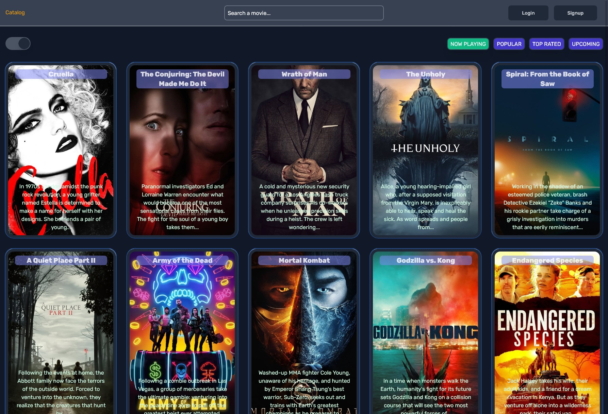

<p align="center">
<a href="https://flamboyant-ritchie-867001.netlify.app/" target="_blank" rel="noopener noreferrer">

</a>
</p>

<br/>
<p align="center">Tools used</p>

# Vite ⚡

- 💡 Component
- ⚡️ Lightning Fast HMR
- 📦 Optimized Build
- 🔑 Fully Typed APIs

# VueX ⚡

💡 Every page have own vuex state

```
1. fav.js - for working with favorites
2. auth.js - for working with firebase and login/signup page
3. movie - movie per page
4. movies - catalog movies
```

# Vue Router ⚡

- 💡 for working with favorites

<br/>
<br/>
<br/>
<center>

</center>
<br/>

# License

MIT
